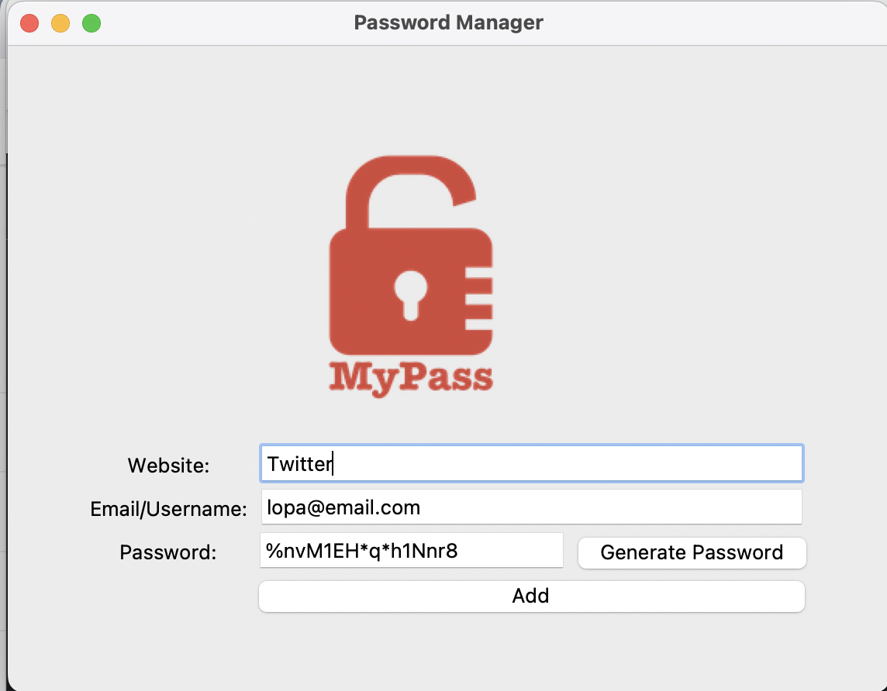
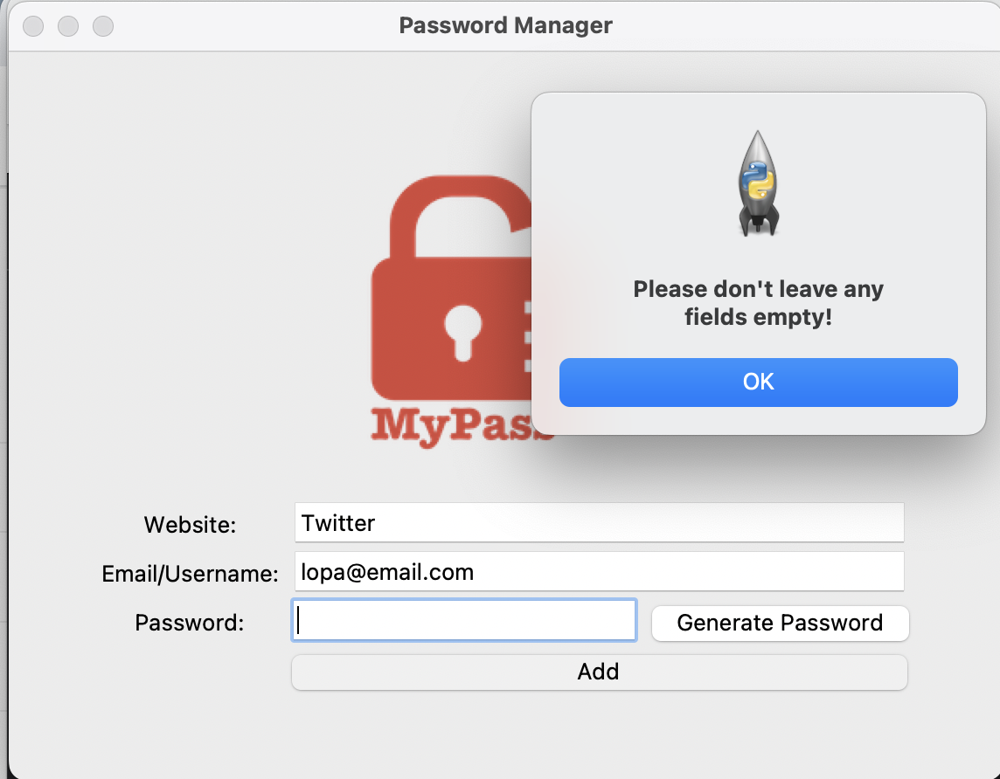
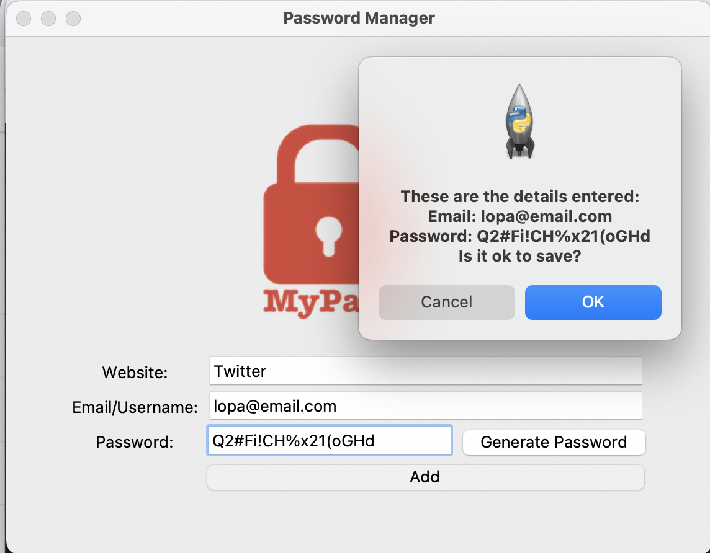

# Password Generator

This project creates a password generator. It has an UI which allows you to save the following fields in a text file:
- Website
- Email/Username
- Password

The email/username is pre-populated to use the most commonly used email.

### Generate Password
This feature allows to generate a complicated password. Users can click on "Generate Password" button
to use the ease of automatically getting a password without manually typing.

Once you get a password, it also copies it to the clipcoard, thus making it easy to **_Paste_** it where you need.

It uses the Pyperclip module.

### Check for empty fields
This features pops up a dialog box if any of the fields are empty when user clicks "Add" button.

It makes sure that all fields have data before saving it into file data.txt.

### Dialog box
A dialog box appears after you click "Add" button, to allow users to verify the data before saving it to the file.

- Ok: Data is saved in data.txt
- Cancel: It doesn't save and allows the user to edit the fields.

